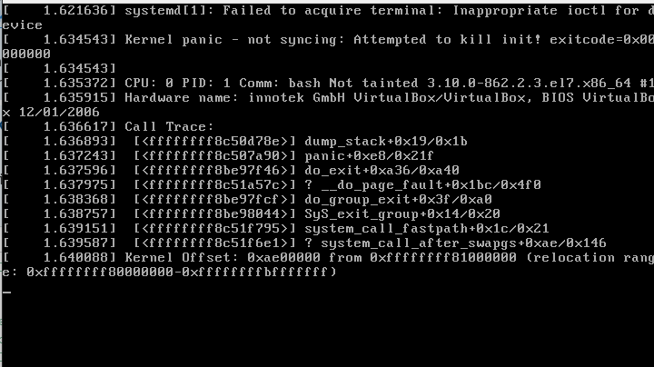
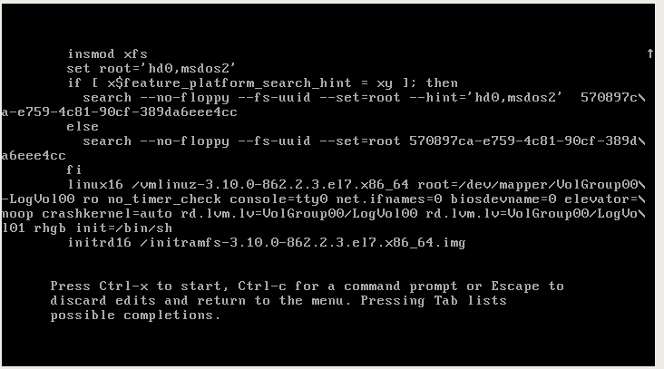
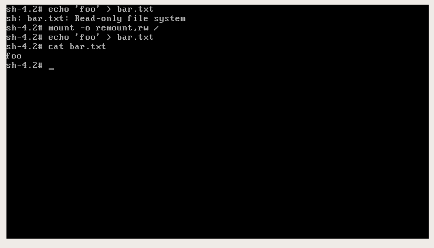
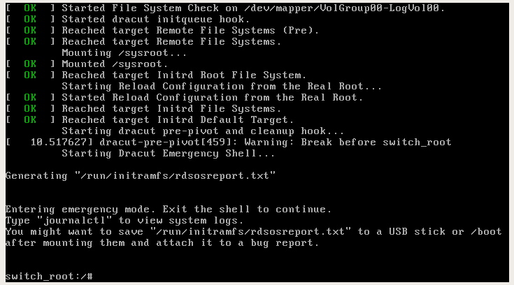
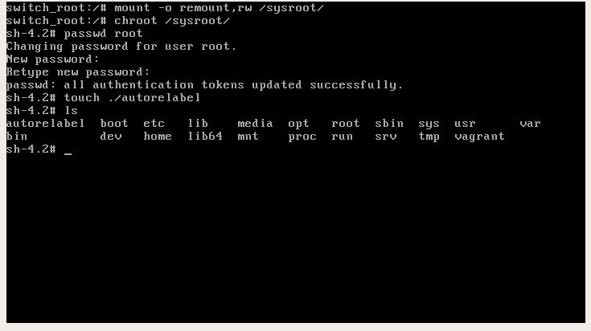
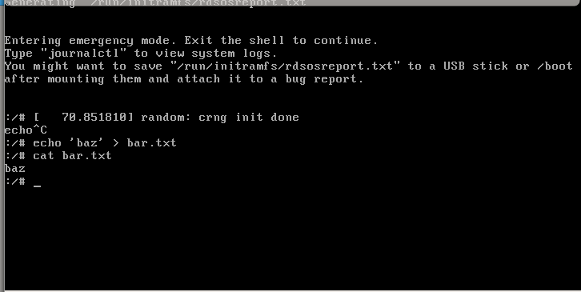
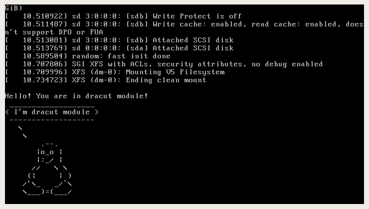

# Homework #4. System boot

## Getting into the system without a password in several ways

### Method 1. `init=/bin/sh`

At the end of the line beginning with `linux16`, add `init=/bin/sh` and press `Ctrl-x` to boot into the system.  
You might get this error when trying to add `init=/bin/bash` or `init=/bin/sh` at the very end of the `linux16` command:



The problem is in the line `console=ttyS0`, after deleting it and adding correct parameters we get this picture:



You're in the system. But there is one thing.  
Root file system is mounted in the Read-Only mode.  
If you want to remount it in the Read-Write mode can be used:
```
sh-4.2# mount -o remount,rw /
```

After that you can make sure by writing data to any file or reading the output commands:
```
sh-4.2# mount | grep root
```



### Method 2. `rd.break`

At the end of the line beginning with `linux16`, add `rd.break` and press `Ctrl-x` to boot into the system.  
We're in emergency mode. Our root file system is mounted again in Read-Only mode, but we're not in it.  
Here is an example of how to get into it and change administrator password:
```
sh-4.2# mount -o remount,rw /sysroot
sh-4.2# chroot /sysroot
sh-4.2# passwd root
sh-4.2# touch /.autorelabel
```




### Method 3. `rw init=/sysroot/bin/sh`

In the line beginning with `linux16`, replace `ro` with `rw init=/sysroot/bin/sh` and press `Ctrl-x` to boot into the system.  
Generally the same as in the previous example, but the file system already is mounted in Read-Write mode.  
In previous examples, you can also replace `ro` with `rw`.




## Install the system with LVM, then rename the VG

First of all, check the current state of the system:
```
[root@lvm vagrant]# vgs
  VG         #PV #LV #SN Attr   VSize   VFree
  VolGroup00   1   2   0 wz--n- <38.97g    0 
```

Rename it:
```
[root@lvm vagrant]# vgrename VolGroup00 OtusRoot
  Volume group "VolGroup00" successfully renamed to "OtusRoot"
```

Then change `/etc/fstab`, `/etc/default/grub`, `/boot/grub2/grub.cfg`. 
Everywhere we replace the old name with a new one:
```
[root@lvm vagrant]# vi /etc/fstab 
[root@lvm vagrant]# vi /etc/default/grub
[root@lvm vagrant]# vi /boot/grub2/grub.cfg
```

Recreate the `initrd` image so that it knows the new name of the Volume Group:
```
[root@lvm vagrant]# mkinitrd -f -v /boot/initramfs-$(uname -r).img $(uname -r)
*** Creating image file ***
*** Creating image file done ***
*** Creating initramfs image file '/boot/initramfs-3.10.0-862.2.3.el7.x86_64.img' done ***
```

After that, we can reboot and if everything is done correctly - successfully loaded with
with the new name Volume Group and check it out:
```
[root@lvm vagrant]# vgs
  VG       #PV #LV #SN Attr   VSize   VFree
  OtusRoot   1   2   0 wz--n- <38.97g    0 
```


## Add module to `initrd`

Create new folder `01test` in `/usr/lib/dracut/modules.d/`, add two scripts there and make them executable:
```
[root@lvm vagrant]# cd /usr/lib/dracut/modules.d/
[root@lvm modules.d]# mkdir 01test

[root@lvm modules.d]# cd 01test/
[root@lvm 01test]# vi module-setup.sh
[root@lvm 01test]# vi test.sh

[root@lvm 01test]# chmod +x module-setup.sh test.sh 

[root@lvm 01test]# ll
total 8
-rwxr-xr-x. 1 root root 127 Nov 29 18:21 module-setup.sh
-rwxr-xr-x. 1 root root 333 Nov 29 18:22 test.sh
```

Reassemble `initrd` image (one of the two ways):
```
[root@lvm modules.d]# dracut -f -v
*** Creating image file ***
*** Creating image file done ***
*** Creating initramfs image file '/boot/initramfs-3.10.0-862.2.3.el7.x86_64.img' done ***
```
```
[root@lvm modules.d]# mkinitrd -f -v /boot/initramfs-$(uname -r).img $(uname -r)
*** Creating image file ***
*** Creating image file done ***
*** Creating initramfs image file '/boot/initramfs-3.10.0-862.2.3.el7.x86_64.img' done ***
```

You can check/view which modules are loaded into the image:
```
[root@lvm modules.d]# lsinitrd -m /boot/initramfs-$(uname -r).img | grep test
test
```

Then you can go two ways to check:
* Reboot and by hand remove `rghb` and `quiet` options
* Or edit `grub.cfg` to remove these options

Reboot and check:



